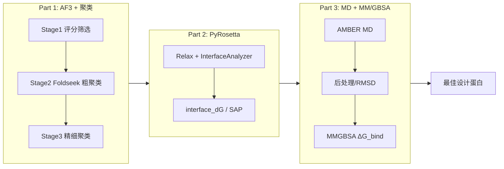
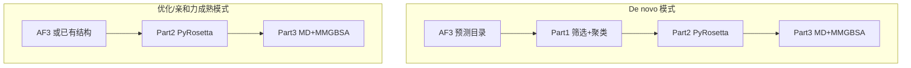

# Protein Filter Pipeline 总览

`protein_filter_lib` 作为蛋白质设计流程的**筛选组件**，将设计结果的评估分为三个部分，最终得到最佳设计蛋白。

## 流程架构

### 流程图（Mermaid）

### 两种模式

### 文字概要

- **Part 1**: AF3 预测指标与互作分析  
  Stage 1 评分筛选 → Stage 2 Foldseek 粗聚类 → Stage 3 簇内 H–A 接触精细聚类

- **Part 2**: PyRosetta 静态物理分析  
  Interface 能量（interface_dG 等）、Relax、SAP、界面指标  
  参考: `germinal`、PPIFlow 等外部工具

- **Part 3**: MD 计算  
  AMBER MD + 后处理（RMSD）+ MM/GBSA；对接 Part 2 CSV，输出结合自由能等（入口：`scripts/run_part3.py`、`scripts/run_optimization_pipeline.sh`）

- 最终产出：**最佳设计蛋白**

## 各部分说明（与当前脚本对齐）

- **Part 1**: AF3 相关预测指标计算与互作分析（评分筛选 + 聚类）  
  - 脚本/模块：  
    - 主入口（Python）：`scripts/part1/part1_analyze_af3_three_stage.py`  
    - De novo orchestrator：`scripts/part1/part1_run_denovo_orchestrator.py`（由 `scripts/run_denovo_design.sh` 调用）  
    - 底层工具：`src/protein_filter/utils/af3_utils.py`, `src/protein_filter/utils/pdockq_utils.py`, `src/protein_filter/clustering/*`  
  - 文档: [PART1_AF3_AND_CLUSTERING.md](PART1_AF3_AND_CLUSTERING.md), [STAGE1_CLUSTERING_OPTIMIZATION.md](STAGE1_CLUSTERING_OPTIMIZATION.md), [STAGE1_RELAXED_THRESHOLDS.md](STAGE1_RELAXED_THRESHOLDS.md)

- **Part 2**: 基于 PyRosetta 的界面能量与物理指标  
  - 脚本/模块：  
    - 主入口（批处理）：`scripts/part2/part2_run_pyrosetta_static_relax_interface.py`  
    - 外层封装：`scripts/part2/part2_run_pyrosetta_batch.sh`，以及顶层 `scripts/run_optimization_pipeline.sh` 中的 Part2 步骤  
    - 计算核心：`src/protein_filter/metrics/calculators.py` 中的 `InterfaceCalculator` 等  
  - 文档: [PART2_PYROSETTA.md](PART2_PYROSETTA.md), [PART2_PYROSETTA_BATCH_USAGE.md](PART2_PYROSETTA_BATCH_USAGE.md), [PYROSETTA_RELAX_DEFAULT.md](PYROSETTA_RELAX_DEFAULT.md)

- **Part 3**: MD / AMBER 动态物理打分（MM/GBSA、RMSD 变化）  
  - 脚本/模块：  
    - De novo 模式 Part3 入口：`scripts/run_denovo_design.sh`（通过 FullPipelineConfig 控制是否运行 Part3）  
    - 优化模式 Part3 入口：`scripts/run_optimization_pipeline.sh`（内部调用 `scripts/part3/part3_run_amber_md_31driver.py`）  
    - 单结构 AMBER 后端：`AMBER/run_single.sh` 及 `AMBER/*.in` 模板  
    - MM(PB/GB)SA 汇总：`AMBER_MMPBSA/collect_mmgbsa_binding_to_csv.py`、`src/protein_filter/metrics/mmgbsa.py`  
  - 文档: [PART3_MD.md](PART3_MD.md)、[PART3_AMBER_WORKFLOW_SUMMARY.md](PART3_AMBER_WORKFLOW_SUMMARY.md)、[PART3_AMBER_POSTPROCESS.md](PART3_AMBER_POSTPROCESS.md)、[PART3_RESULTS_INTERPRETATION.md](PART3_RESULTS_INTERPRETATION.md)

## 推荐使用顺序

1. 运行 **Part 1** 三阶段流程，得到通过 AF3 筛选、聚类后的结构列表（如 `fine_clusters/`、`stage1_filtering_result.json`）。
2. 对 Part 1 输出结构运行 **Part 2** PyRosetta 静态分析，得到 `interface_dG` 等界面指标，可选 Relax。
3. 对 Part 2 筛选出的候选运行 **Part 3** MD（MM/GBSA、RMSD），最终确定最佳设计。

## 快速链接

- [Part 1 代码与功能整理](PART1_AF3_AND_CLUSTERING.md)
- [Part 2 PyRosetta 整合说明](PART2_PYROSETTA.md)
- [Part 3 MD 模块说明](PART3_MD.md)
- [三阶段流程使用说明](README_THREE_STAGE.md)
