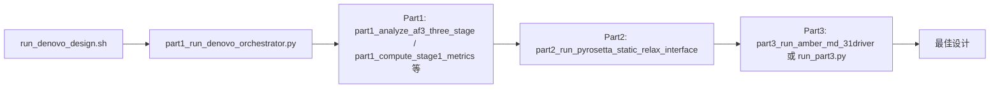
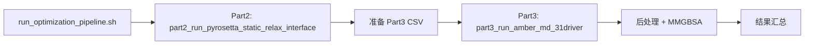

# protein_filter_lib：两模式、三 Part 构建与 GitHub 更新计划

本文档为项目整理与 GitHub 更新（[RuijinHospitalVNAR/protein-filter-lib](https://github.com/RuijinHospitalVNAR/protein-filter-lib)）的总体计划，包含研究流程定义、模块划分、CLI 与现有脚本/函数的映射，以及待办项。

**亲和力成熟模式示例**：输入为 AF3 预测目录，Part2 选 10 个后 Part3 跑 1ns，可参考 `examples/affinity_maturation_example`。

---

## 一、两种研究模式定义

### 模式 A：De novo 蛋白设计

- **场景**：应对大量预测结构和序列，需逐级收窄候选。
- **流程**：
  1. **Part1**：AF3 相关置信度分析（pLDDT、iPTM、PAE 等）+ 结构聚类分析（抗原-抗体互作聚类），找到目标构象群。
  2. **Part2**：对 Part1 通过的设计做静态物理分析（PyRosetta 界面 dG、SAP、二级结构等）。
  3. **Part3**：对 Part2 筛选后的少数候选做 MD + MM/GBSA（或 MM/PBSA），得到结合自由能等动态指标，最终获得可能的突变/设计。

### 模式 B：亲和力成熟

- **场景**：已有初始结构，通过 SaProt、AntiBMPNN、IgGM 等获得突变体设计，数量相对较少。
- **流程**：
  - **跳过 Part1**，直接从 **Part2** 开始：对突变体做 PyRosetta 静态分析。
  - 再进入 **Part3**：对筛选后候选跑 MD + MM/GBSA，用于排序或最终决策。

---

## 二、三 Part 与模块划分

| Part | 职责 | 主要模块/组件 |
|------|------|----------------|
| **Part1** | AF3 置信度 + 结构聚类 + Stage1 快速指标 | `protein_filter.clustering`、`protein_filter.metrics`（AF 置信度、pDockQ、IPSAE 等）、Stage1 parquet 输出 |
| **Part2** | 静态物理分析（PyRosetta 界面、SAP、二级结构） | `protein_filter.core.ProteinFilter`、`FilterConfig`、`Design`、Stage2 parquet |
| **Part3** | MD + MM/GBSA（或 MM/PBSA） | `scripts/run_part3.py`、`AMBER_MMPBSA/`、`run_md_mmgbsa_rmsd.py`，结果汇总 `collect_mmgbsa_binding_to_csv.py` |

---

## 二点五、两种模式的调用链

以下为当前推荐入口下的调用关系；等价 CLI 见第三节。

### De novo 模式

等价 CLI：`pf-part1-compute-metrics`、`pf-part1-filter`、`pf-part2-compute-metrics`、`pf-part2-filter`、`pf-part3-collect-mmgbsa`。

### Optimizing 模式

无 Part1；Part2/Part3 脚本与 De novo 共用，汇总使用 `pf-part3-collect-mmgbsa` 或 `AMBER_MMPBSA/collect_mmgbsa_binding_to_csv.py`。

---

## 三、CLI 与现有脚本/函数映射表

以下为「推荐 CLI 名称 → 当前实现 → 长期库函数」的对应关系，便于在保留现有脚本的前提下逐步收敛到库 API。

### Part1：AF3 置信度 + 聚类（仅模式 A）

| 推荐 CLI | 作用 | 当前实现（脚本/入口） | 长期建议调用的库/函数 |
|----------|------|------------------------|------------------------|
| `pf-part1-compute-metrics` | 从 AF3 目录计算 Stage1 快速指标（pLDDT/iPTM/PAE、clashes、pDockQ、IPSAE 等）+ 可选聚类筛选，输出 parquet | `scripts/part1/part1_compute_stage1_metrics.sh` | `protein_filter.pipeline.stage1.compute_stage1_metrics(config)`，内部用 `protein_filter.metrics` + `protein_filter.clustering` |
| `pf-part1-filter` | 基于 `stage1_metrics.parquet` 做多指标筛选 + 综合评分 Top-N | `scripts/part1/part1_filter_stage1_metrics.sh` | `protein_filter.pipeline.stage1.filter_stage1(config)`，底层用 `protein_filter.filters` 引擎 |

### Part2：静态物理分析（模式 A 与 B 共用）

| 推荐 CLI | 作用 | 当前实现（脚本/入口） | 长期建议调用的库/函数 |
|----------|------|------------------------|------------------------|
| `pf-part2-compute-metrics` | PyRosetta 计算界面 dG、SAP、二级结构等，写 Stage2 parquet | `scripts/part1/part1_compute_stage2_metrics.sh` | `protein_filter.pipeline.stage2.compute_stage2_metrics(config)`，内部用 `ProteinFilter`/metrics 子模块 |
| `pf-part2-filter` | 基于 Stage2 parquet 做最终静态筛选 | `scripts/part1/part1_filter_stage2_metrics.sh` | `protein_filter.pipeline.stage2.filter_stage2(config)` |
| （兼容） | 小规模/单批 Part2（如亲和力成熟少量突变体） | `scripts/run_pyrosetta_static.py` | 可保留为薄封装，内部迁到 `protein_filter.pipeline.part2` |

### Part3：MD + MM/GBSA（模式 A 与 B 共用）

| 推荐 CLI | 作用 | 当前实现（脚本/入口） | 长期建议 |
|----------|------|------------------------|----------|
| `pf-part3-prepare-md` | 从筛选结果生成 MD 输入（Amber 等），分配 gpu0..7 | `scripts/run_part3.py`、`scripts/run_amber_31_driver.py`、`finish_relaxed_part3_setup.sh` 等 | 将「要跑哪些 case + 配置」的调度封装到 `protein_filter.pipeline.part3`，具体 amber 命令仍放 scripts |
| `pf-part3-run-md` | 启动/监控 MD 生产（如 100ns） | `scripts/run_md_mmgbsa_rmsd.py`、`scripts/monitor_part3.sh` | 保持为系统级脚本，库中仅提供参数与结果路径约定 |
| `pf-part3-collect-mmgbsa` | 收集各模型 `FINAL_RESULTS_MMGBSA_BINDING.dat`，输出 ΔG_bind CSV | `AMBER_MMPBSA/collect_mmgbsa_binding_to_csv.py` | 可迁为 `protein_filter.metrics.mmgbsa.collect_binding_to_csv`，CLI 调用该函数 |

---

## 四、实施步骤摘要

1. **梳理现有结构**：整理 `src/protein_filter` 与 `scripts/*.sh` 的职责与数据流，与 README 对齐。
2. **稳定库 API**：明确 `FilterConfig`、`ProteinFilter`、`Design` 的对外接口与 `protein_filter.metrics`/`filters` 划分。
3. **CLI 与脚本收敛**：为 Part1/Part2 增加 Python 入口（如 `python -m protein_filter.cli.part1_compute`），shell 仅做环境与参数转发；Part3 保持脚本驱动，库只做配置与汇总。
4. **三 Part 实现**：Part A 指标、Part B 筛选、Part C 流水线 orchestrator 分别落位到 `metrics`、`filters`、`pipeline`。
5. **AF3/工作流整合**：确保 `install_in_alphafold3.sh`、`check_environment.py` 与文档中的 Part1→Part2→Part3 示例一致。
6. **文档与示例**：更新 README、`docs/`，在 `examples/` 中增加「最小库用法」与「两阶段筛选」示例。
7. **测试与 CI（可选）**：为关键 metrics 和 pipeline 加单元/集成测试，可选 GitHub Actions。
8. **GitHub 更新**：分支提交、更新 README/docs、按需打 tag 发布。

---

## 五、待办（TODO）

- [ ] **analyze-existing-structure**：梳理 protein_filter_lib 现有包结构、脚本和 README 中的两种模式/三部分设计。
- [ ] **stabilize-library-api**：稳定并整理 ProteinFilter、FilterConfig、Design 等核心库 API 与模块划分。
- [ ] **design-cli-entrypoints**：定义并实现 Part1/Part2（及可选 Part3 汇总）的 CLI 入口，复用库逻辑。
- [ ] **implement-metrics-filters-pipeline**：将指标计算、筛选、流水线分别实现到 metrics、filters、pipeline 模块。
- [ ] **integrate-with-af3-workflow**：确保 AF3 集成脚本和用法与新结构一致，并给出示例。
- [ ] **update-docs-and-examples**：更新 README 与 examples，体现两种模式和三段式架构。
- [ ] **add-tests-and-ci**：为关键指标和流水线添加测试，并配置基础 CI（可选）。
- [ ] **github-branch-and-release**：通过 Git 分支和 PR 将改动推到 GitHub，并视需要发布新版本。
- [ ] **mmgbsa-as-metric**（后续）：将 MM/GBSA 汇总整理为可选能量指标组件（如 `protein_filter.metrics.mmgbsa`），并文档化「外部打分接入」示例。

---

## 六、独立 To-Do 列表（便于逐项勾选）

| ID | 状态 | 内容 |
|----|------|------|
| analyze-existing-structure | 待办 | 梳理 protein_filter_lib 现有包结构、脚本和 README 中的两种模式/三部分设计 |
| stabilize-library-api | 待办 | 稳定并整理 ProteinFilter、FilterConfig、Design 等核心库 API 与模块划分 |
| design-cli-entrypoints | 待办 | 定义并实现 Part1/Part2（及 Part3 汇总）的 CLI 入口，复用库逻辑 |
| implement-metrics-filters-pipeline | 待办 | 将指标计算、筛选、流水线分别实现到 metrics、filters、pipeline 模块 |
| integrate-with-af3-workflow | 待办 | 确保 AF3 集成脚本和用法与新结构一致，并给出示例 |
| update-docs-and-examples | 待办 | 更新 README 与 examples，体现两种模式和三段式架构 |
| add-tests-and-ci | 待办 | 为关键指标和流水线添加测试，并配置基础 CI（可选） |
| github-branch-and-release | 待办 | 通过 Git 分支和 PR 将改动推到 GitHub，并视需要发布新版本 |
| mmgbsa-as-metric | 后续 | 将 MM/GBSA 汇总整理为可选能量指标组件并文档化 |

---

## 七、示例运行（10+WT 共 11 个结构）

使用**已有 31 个 Part3 结构**中的 **10 个突变体 + WT** 做一次 Part3 收集示例，验证 CLI 与库：

1. **准备**：在 `examples/part3_example_11/` 下用 `setup_11_links.py` 对 11 个 model 的 `FINAL_RESULTS_MMGBSA_BINDING.dat` 建符号链接到 `amber_11/`。
2. **运行**：`pf-part3-collect-mmgbsa -i examples/part3_example_11/amber_11 -o examples/part3_example_11/mmgbsa_11.csv`。
3. **结果**：得到 11 行 CSV（model, delta_total, delta_total_stddev, delta_total_stderr, path），可与 WT 的 ΔG_bind 对比。

详见 [examples/part3_example_11/README.md](../examples/part3_example_11/README.md)。示例已跑通并生成 `mmgbsa_11.csv`。

---

*文档版本：与两模式（de novo / 亲和力成熟）、三 Part（Part1 AF3+聚类、Part2 静态、Part3 MD+MMGBSA）研究流程一致。*
